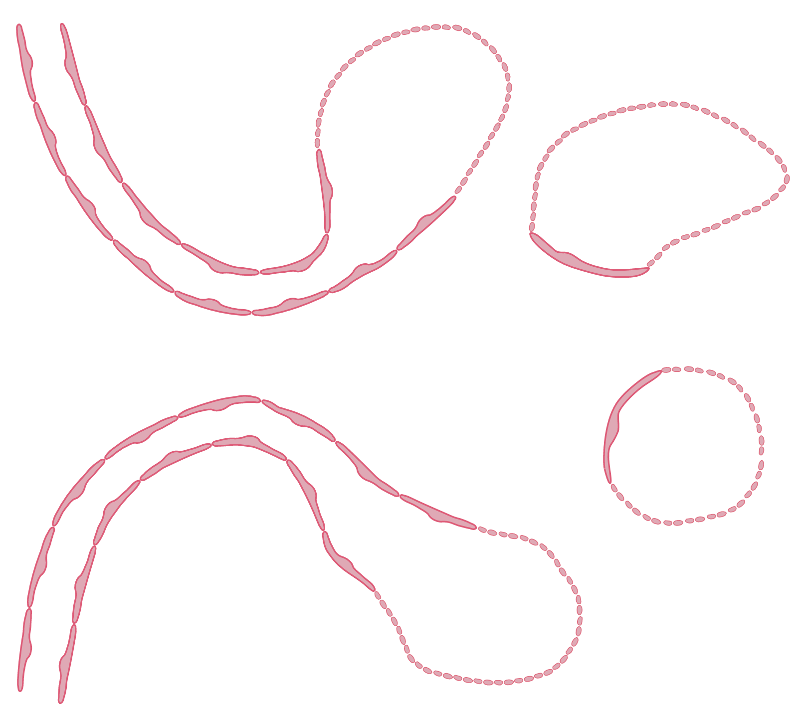
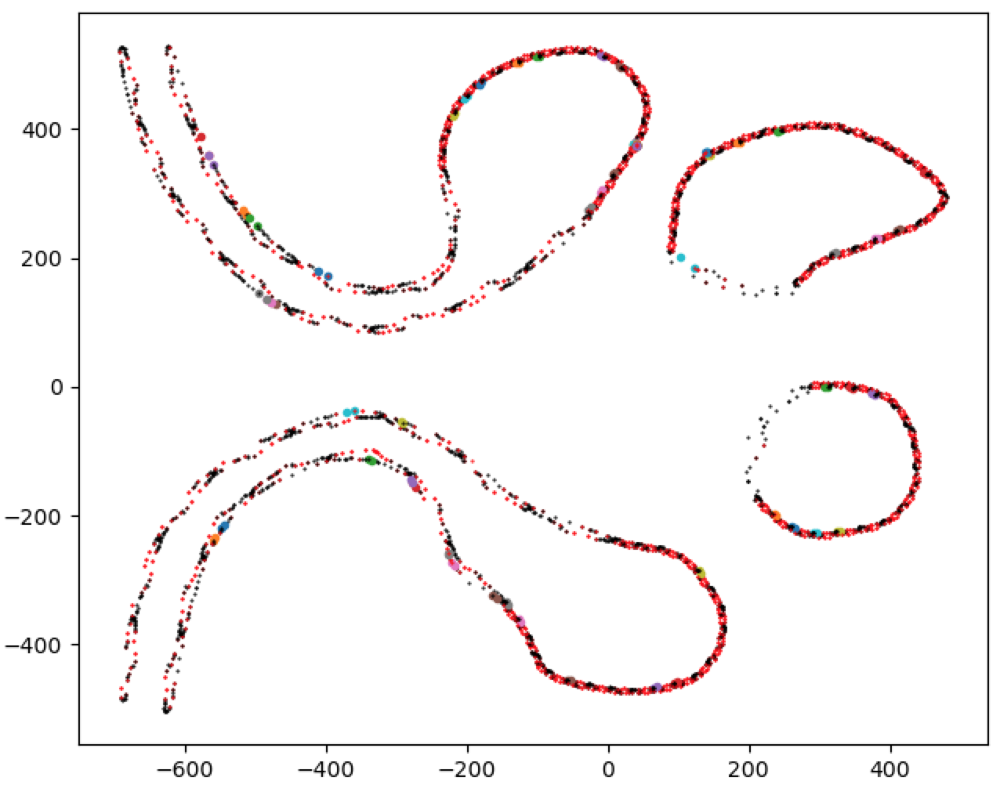
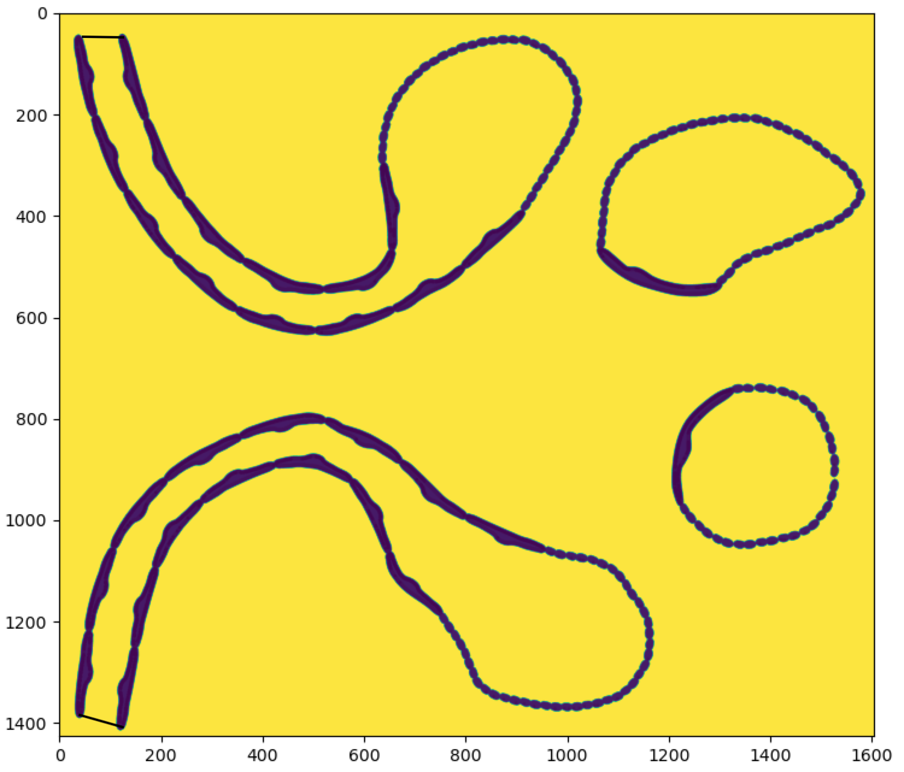
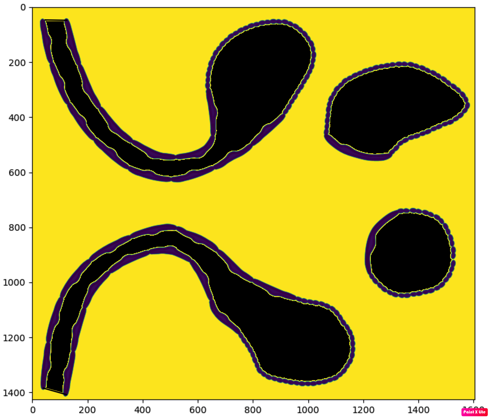
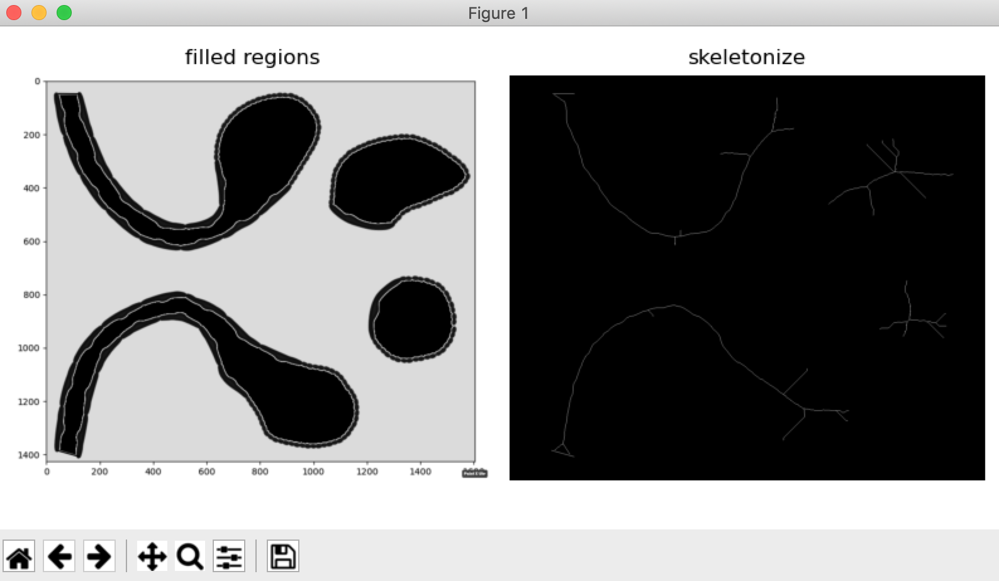

# kidney_level_sets

## Goal: construct a distance function (in C++) that can find the shortest distance from any point in our domain to one of the boundaries of these 4 structures.
Open an SVG file in your browser, e.g., `file:///Users/heiland/git/kidney_level_sets/data/endo_cells.svg`



---
## Process SVG geometry to extract boundary points

```
cd python
python cells_pts.py ../data/endo_cells.svg
```



---
## Failed experiment with image-based approach (and scikit-image)



---

```
cd image_proc
python endo_skeleton.py
```


